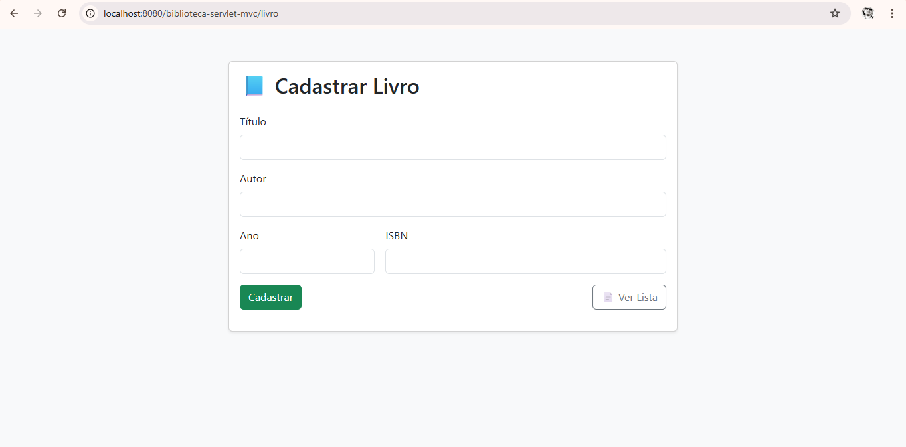
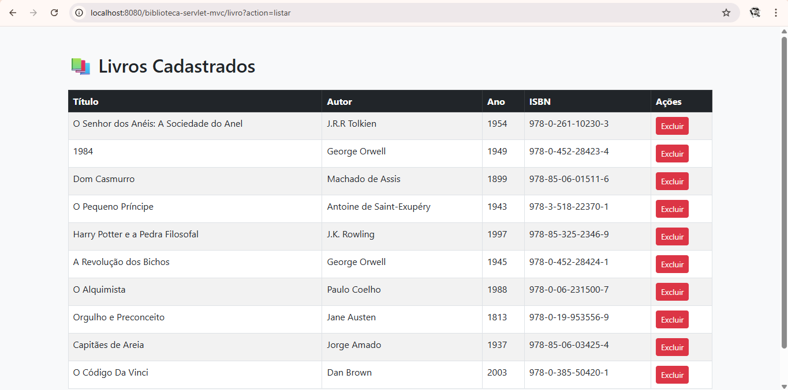
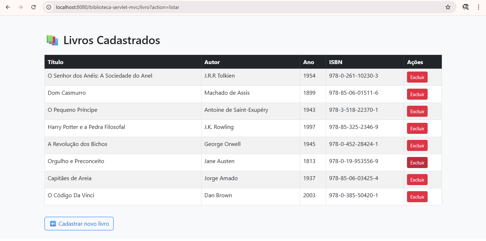

# 📚 Sistema Web de Biblioteca - Java Servlet + JSP + Bootstrap

Projeto desenvolvido por **Lennon Oliveira** como parte da disciplina *Fábrica de Software* no curso de Análise e Desenvolvimento de Sistemas (UNICESUMAR).

---

## 🧾 Descrição

Este sistema web permite o **cadastro, listagem e exclusão de livros** de forma simples, com interface amigável e responsiva. Foi construído com base no padrão arquitetural MVC, utilizando **Java Servlet**, **JSP** e **Bootstrap**.

---

## 🛠️ Tecnologias utilizadas

- Java 17
- Servlets (Jakarta/Javax)
- JSP (JavaServer Pages)
- HTML5 / CSS3
- Bootstrap 5
- Apache Tomcat 9
- Maven
- IntelliJ IDEA Ultimate

---

## 🎯 Funcionalidades

- ✅ Cadastro de livros (título, autor, ano, ISBN)
- ✅ Validação de campos obrigatórios
- ✅ Listagem dos livros cadastrados
- ✅ Exclusão de livros por ISBN
- ✅ Interface responsiva com Bootstrap
- ✅ Estrutura em pacotes: `model`, `controller`, `view`

---

## 📷 Prints do Sistema

### 📝 Tela de Cadastro



### 📄 Tela de Listagem



### ❌ Exclusão de Livro



> Coloque suas imagens reais dentro da pasta `/prints` para que esses links funcionem no GitHub.

---

## 🚀 Como executar localmente

1. Clone o repositório:
```bash
git clone https://github.com/Lennon-Adolfo/biblioteca-servlet-mvc.git
Importe o projeto no IntelliJ como um projeto Maven

Configure um Tomcat 9+ no IntelliJ

Rode o projeto com o contexto:

bash
Copiar
Editar
http://localhost:8080/biblioteca-servlet-mvc/livro
👤 Autor
Lennon Oliveira
📍 Rio Grande - RS
🔗 GitHub
🔗 LinkedIn

📄 Licença
Este projeto é de uso educacional e pessoal. Sinta-se livre para usar como base para estudos e portfólio.

yaml
Copiar
Editar

---

### ✅ Depois:

No terminal:

```bash
git add README.md
git commit -m "Adicionando README do projeto"
git push
